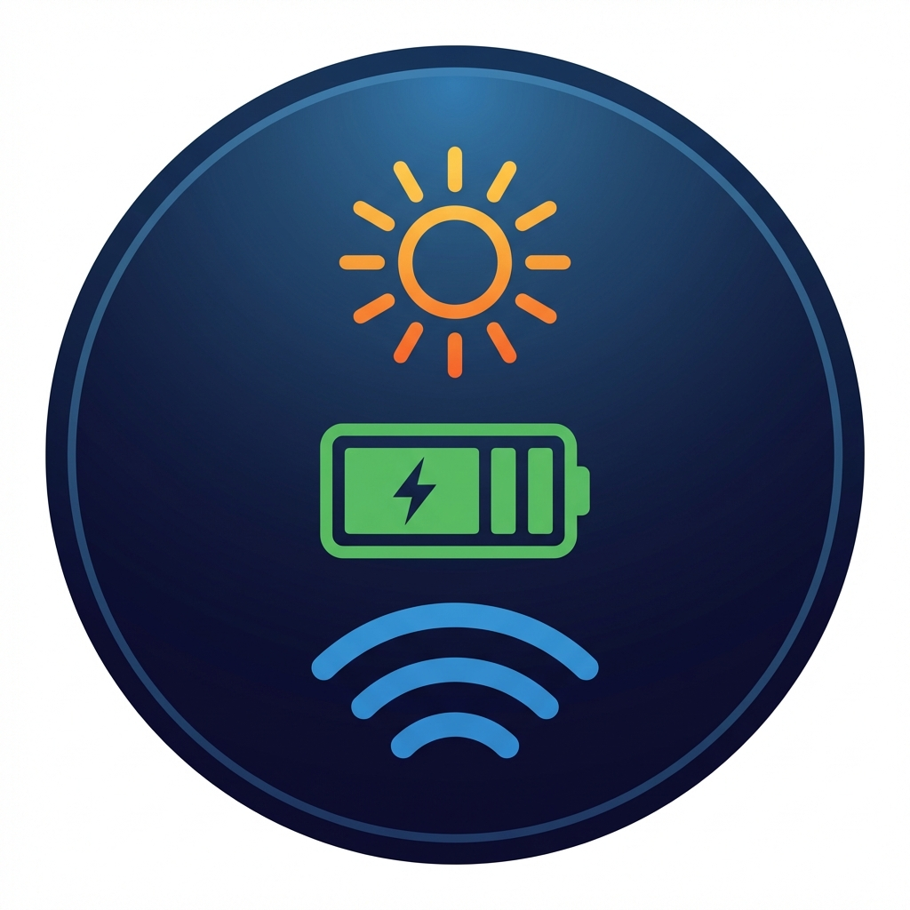

<div align="center">
  
  <h1>Deye EW11 - Home Assistant Integration</h1>
</div>

[](https://github.com/hacs/integration)
[](https://github.com/byrsapty/zotac-deye-monitor/releases)
[](LICENSE)

Інтеграція для моніторингу **гібридних інверторів Deye** через **WiFi донгл EW11**.
Підтримує **Modbus TCP** (пряме підключення) та **MQTT** (через брокер) протоколи.

---

## ✨ Особливості

- 🔌 **Два протоколи підключення:**
  - **Modbus TCP** - пряме підключення до EW11
  - **MQTT** - через брокер (Mosquitto) для більш стабільної роботи
- 💾 **Розумне кешування:** При короткочасних збоях WiFi показує останні успішні дані замість "Unavailable"
- ⚡ **Точні дані:** Напруга батареї з точністю до сотих (52.64V), потужність генератора
- 🔋 **Розумний розрахунок часу роботи:**
  - **При зарядці:** Показує час до повного заряду
  - **При розрядці:** Показує час до повного розряду
  - **Формат:** Автоматично "14 год 46 хв" або "45 хв"
- ⚙️ **Налаштування через UI:** Вибір протоколу, інтервал оновлення, кешування, ємність батареї
- 🌍 **Мультимовність:** Повна підтримка української та англійської мов

---

## 📊 Сенсори (24+)

### 🔋 Батарея
- **SOC** (%, точний відсоток заряду)
- **Напруга** (V, з точністю 0.01V)
- **Струм** (A)
- **Потужність** (W, + заряд, - розряд)
- **Температура** (°C)
- **Час роботи** (розумний формат "X год Y хв")
- **Залишок енергії** (kWh)

### ☀️ Сонячні панелі (PV)
- **Потужність PV1/PV2** (W)
- **Напруга PV1/PV2** (V)
- **Струм PV1/PV2** (A)
- **Загальна потужність PV** (W)

### 🏠 Навантаження та мережа
- **Потужність навантаження** (W)
- **Потужність мережі** (W, + споживання, - віддача)
- **Напруга мережі** (V)
- **Частота мережі** (Hz)

### ⚙️ Генератор
- **Потужність генератора** (W)
- **Статус генератора** (Running/Stopped)

### 📈 Денна статистика
- День: Заряд батареї (kWh)
- День: Розряд батареї (kWh)
- День: Імпорт з мережі (kWh)
- День: Експорт в мережу (kWh)
- День: Споживання будинку (kWh)
- День: Вироблено PV (kWh)

---

## 📦 Встановлення

### Спосіб 1: Через HACS (Рекомендовано)

1. Відкрийте **HACS** в Home Assistant
2. Перейдіть в розділ **Integrations**
3. Натисніть **три крапки (⋮)** → **Custom repositories**
4. Додайте репозиторій:
   ```
   https://github.com/byrsapty/zotac-deye-monitor
   ```
5. **Category:** `Integration`
6. Натисніть **ADD**
7. Знайдіть **Deye EW11 Inverter** в списку та натисніть **DOWNLOAD**
8. **Перезапустіть Home Assistant**

### Спосіб 2: Вручну

1. Завантажте [останню версію](https://github.com/byrsapty/zotac-deye-monitor/releases)
2. Розпакуйте архів
3. Скопіюйте папку `custom_components/deye_ew11` в:
   ```
   /config/custom_components/deye_ew11
   ```
4. Перезапустіть Home Assistant

---

## ⚙️ Налаштування

### Перше підключення

1. Перейдіть: **Settings** → **Devices & Services**
2. Натисніть **+ ADD INTEGRATION**
3. Знайдіть **Deye EW11**
4. Введіть параметри:

   | Параметр | Значення | Примітка |
   |----------|----------|----------|
   | **IP адреса** | `192.168.1.103` | IP вашого EW11 донгла |
   | **Порт** | `502` або `8899` | Зазвичай 502 для Modbus TCP |
   | **Slave ID** | `1` | Зазвичай 1 для Deye |
   | **Ємність батареї** | `10.24` | Загальна ємність в kWh |
   | **Інтервал оновлення** | `5` | Секунди (рекомендовано 5-10) |

5. Натисніть **SUBMIT**

### Додаткові налаштування

Після додавання інтеграції ви можете змінити параметри:

1. Перейдіть в **Settings** → **Devices & Services** → **Deye EW11**
2. Натисніть **CONFIGURE**
3. Доступні опції:
   - **Інтервал оновлення:** Як часто запитувати дані (1-60 сек)
   - **Увімкнути кешування:** Показувати старі дані при збоях
   - **Макс. спроб:** Скільки разів пробувати перед показом "Disconnected"

---

## � Протоколи підключення

Інтеграція підтримує **два протоколи** для роботи з EW11. Виберіть той, що вам підходить:

### 📡 Modbus TCP (Рекомендовано для початківців)

**Переваги:**
- ✅ Просте налаштування - тільки IP адреса
- ✅ Не потребує додаткового ПЗ
- ✅ Пряме підключення до EW11

**Налаштування:**
1. Виберіть протокол: **Modbus TCP**
2. Введіть:
   - IP адреса EW11
   - Порт (зазвичай 502)
   - Slave ID (зазвичай 1)

**Коли використовувати:**
- Локальна мережа з хорошим WiFi
- Перше підключення
- Не потрібна висока стабільність

---

### 📨 MQTT (Для досвідчених користувачів)

**Переваги:**
- ✅ Більш стабільна робота
- ✅ Менше timeout помилок
- ✅ Можливість віддаленого доступу

**Недоліки:**
- ❌ Потребує встановлення Mosquitto broker
- ❌ Складніше налаштування EW11

**Вимоги:**
1. **MQTT Broker:** (Mosquitto)
   ```bash
   # Ubuntu/Debian
   sudo apt-get install mosquitto
   ```
2. **Інтеграція "MQTT" в Home Assistant:**
   - Перейдіть в **Settings** → **Devices & Services**
   - Натисніть **+ ADD INTEGRATION**
   - Знайдіть **MQTT** і налаштуйте підключення до вашого брокера (Mosquitto)

**Встановлення paho-mqtt (для Home Assistant):**

Home Assistant потребує бібліотеку `paho-mqtt` для MQTT протоколу:

```bash
# Увійти в контейнер Home Assistant
docker exec -it homeassistant /bin/bash

# Встановити paho-mqtt
pip install paho-mqtt>=2.0.0

# Вийти
exit

# Перезапустити Home Assistant
```

Або якщо використовуєте Home Assistant Core (не Docker):
```bash
pip install paho-mqtt>=2.0.0
```

**Налаштування Mosquitto (додати користувача):**

Якщо використовуєте Mosquitto addon в Home Assistant:
1. Settings → Add-ons → Mosquitto broker → Configuration
2. Додайте користувача в секцію `logins`:
```yaml
logins:
  - username: mqtt_user
    password: mqtt_password_123
```
3. Save → Restart addon

**Налаштування EW11:**
1. Відкрийте веб-інтерфейс EW11: `http://<IP_EW11>`
2. Виберіть режим: **MQTT Client**
3. Налаштуйте:
   - Server IP: IP вашого ПК з Mosquitto (наприклад `192.168.1.155`)
   - Server Port: `1883`
   - **MQTT Account:** `mqtt_user`
   - **MQTT Password:** `mqtt_password_123`
   - Subscribe Topic: `deye/request`
   - Publish Topic: `deye/response`
4. Збережіть та перезавантажте EW11

**Налаштування Home Assistant:**
1. Виберіть протокол: **MQTT (via Mosquitto)**
2. Введіть:
   - Broker IP: `127.0.0.1` (якщо Mosquitto на тому ж ПК)
   - Broker Port: `1883`
   - **MQTT Username:** `mqtt_user`
   - **MQTT Password:** `mqtt_password_123`
   - Request Topic: `deye/request`
   - Response Topic: `deye/response`

> **💡 Примітка:** Username/Password опціональні - якщо залишити порожніми, підключення буде анонімним (потребує `allow_anonymous: true` в Mosquitto)

---

## 🤔 Який протокол обрати?

| Критерій | Modbus TCP | MQTT |
|----------|-----------|------|
| **Складність** | 🟢 Проста | 🟡 Середня |
| **Стабільність** | 🟡 Добра | 🟢 Відмінна |
| **Швидкість** | 🟢 Швидше | 🟡 Трохи повільніше |
| **Додаткове ПЗ** | ❌ Не потрібно | ✅ Mosquitto |
| **Для початківців** | ✅ | ❌ |

**Рекомендація:** Почніть з **Modbus TCP**. Якщо виникають проблеми зі стабільністю - переходьте на **MQTT**.

---

## �🔧 Сумісність

### Перевірені моделі інверторів:
- ✅ Deye SUN-5K-SG03LP1-EU
- ✅ Deye SUN-10K-SG04LP3-EU
- ✅ Deye SUN-12K-SG04LP3-EU
- ✅ (Більшість гібридних моделей Deye з підтримкою EW11)

### Вимоги:
- Home Assistant 2024.1.0 або новіше
- WiFi донгл EW11 підключений до інвертора
- Локальна мережа (інтеграція працює через Modbus TCP)

---

## 🐛 Відомі проблеми та їх вирішення

### Сенсори показують "Unavailable"
- Перевірте IP адресу та порт EW11
- Переконайтесь що EW11 підключений до WiFi
- Спробуйте збільшити інтервал оновлення до 10 сек
- Увімкніть кешування в налаштуваннях

### Неправильні значення потужності
- Переконайтесь що Slave ID правильний (зазвичай 1)
- Перезавантажте інвертор та EW11

### Генератор не відображається
- Переконайтесь що генератор фізично підключений
- Перевірте регістр 166 (0xA6) в налаштуваннях інвертора

---

## 📝 Ліцензія

MIT License - дивіться [LICENSE](LICENSE) для деталей.

---

## 🤝 Підтримка проєкту

Якщо ця інтеграція вам допомогла, поставте ⭐ на GitHub!

Знайшли баг або є ідея? [Створіть Issue](https://github.com/byrsapty/zotac-deye-monitor/issues)

---

## 👨‍💻 Автор

Розроблено з ❤️ для української спільноти Home Assistant.
